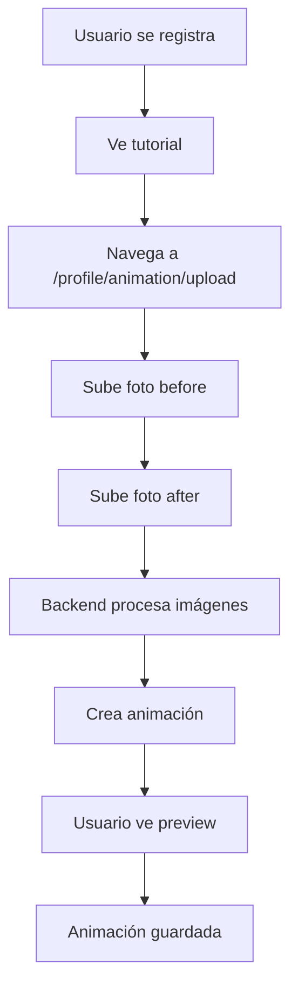
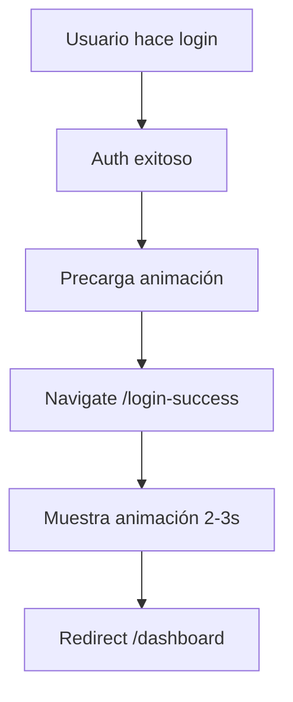

# Sistema de Animaciones Personalizadas de Maquillaje

## Descripción

Sistema que permite a las usuarias de LOBBA crear animaciones personalizadas mostrando su transformación de maquillaje (antes/después) que se reproduce automáticamente al iniciar sesión en la PWA.

## Arquitectura

```
┌─────────────┐      ┌──────────────┐      ┌───────────────┐      ┌──────────┐
│   Frontend  │─────▶│  Backend API │─────▶│ Image Processor│─────▶│ Storage  │
│   (React)   │◀─────│   (Express)  │◀─────│    (Sharp)     │◀─────│  Local   │
└─────────────┘      └──────────────┘      └───────────────┘      └──────────┘
                             │
                             ▼
                      ┌──────────────┐
                      │  PostgreSQL  │
                      │  user_       │
                      │  animations  │
                      └──────────────┘
```

---

## Base de Datos

### Tabla `user_animations`

```sql
CREATE TABLE user_animations (
  id UUID PRIMARY KEY DEFAULT gen_random_uuid(),
  user_id UUID NOT NULL UNIQUE REFERENCES users(id) ON DELETE CASCADE,
  
  before_image_url VARCHAR(500) NOT NULL,
  after_image_url VARCHAR(500) NOT NULL,
  before_image_thumbnail VARCHAR(500),
  after_image_thumbnail VARCHAR(500),
  animation_video_url VARCHAR(500),
  
  animation_type VARCHAR(50) DEFAULT 'crossfade',
  animation_duration INTEGER DEFAULT 2500,
  
  is_active BOOLEAN DEFAULT true,
  created_at TIMESTAMP DEFAULT CURRENT_TIMESTAMP,
  updated_at TIMESTAMP DEFAULT CURRENT_TIMESTAMP
);
```

### Campos añadidos a `users`

```sql
ALTER TABLE users 
  ADD COLUMN has_custom_animation BOOLEAN DEFAULT false,
  ADD COLUMN animation_enabled BOOLEAN DEFAULT true;
```

---

## API Endpoints

### 1. GET /api/users/:userId/animation

Obtiene la configuración de animación de un usuario.

**Auth:** JWT Token requerido  
**Permisos:** Solo el usuario propietario o admin

**Response exitoso:**
```json
{
  "success": true,
  "data": {
    "userId": "uuid-123",
    "hasCustomAnimation": true,
    "animationType": "crossfade",
    "animationDuration": 2500,
    "assets": {
      "beforeImage": "http://localhost:3000/uploads/users/uuid/animations/before.webp",
      "afterImage": "http://localhost:3000/uploads/users/uuid/animations/after.webp",
      "beforeThumbnail": "http://localhost:3000/uploads/.../before_thumb.webp",
      "afterThumbnail": "http://localhost:3000/uploads/.../after_thumb.webp",
      "videoUrl": null
    }
  }
}
```

**Response sin animación:**
```json
{
  "success": true,
  "data": {
    "userId": "uuid-123",
    "hasCustomAnimation": false
  }
}
```

**Ejemplos de uso:**
```bash
# Con curl
curl -H "Authorization: Bearer YOUR_TOKEN" \
  http://localhost:3000/api/users/UUID/animation

# Con fetch (JavaScript)
const response = await fetch(`${API_URL}/api/users/${userId}/animation`, {
  headers: { 'Authorization': `Bearer ${token}` }
})
const data = await response.json()
```

---

### 2. POST /api/users/:userId/upload-animation-photos

Sube las fotos before/after y crea la animación personalizada.

**Auth:** JWT Token requerido  
**Permisos:** Solo el usuario propietario

**Request:** `multipart/form-data`
- `beforePhoto`: File (JPEG, PNG, WebP, max 5MB)
- `afterPhoto`: File (JPEG, PNG, WebP, max 5MB)

**Validaciones:**
- Tamaño máximo: 5MB por archivo
- Formatos permitidos: JPEG, PNG, WebP
- Dimensiones mínimas: 500x500px

**Response:**
```json
{
  "success": true,
  "message": "Animación creada exitosamente",
  "data": {
    "animationId": "uuid-456",
    "processingStatus": "completed",
    "previewUrl": "http://localhost:3000/uploads/..."
  }
}
```

**Ejemplo con curl:**
```bash
curl -X POST \
  -H "Authorization: Bearer YOUR_TOKEN" \
  -F "beforePhoto=@before.jpg" \
  -F "afterPhoto=@after.jpg" \
  http://localhost:3000/api/users/UUID/upload-animation-photos
```

**Ejemplo con JavaScript:**
```javascript
const formData = new FormData()
formData.append('beforePhoto', beforeFile)
formData.append('afterPhoto', afterFile)

const response = await fetch(`${API_URL}/api/users/${userId}/upload-animation-photos`, {
  method: 'POST',
  headers: { 'Authorization': `Bearer ${token}` },
  body: formData
})
```

---

### 3. PUT /api/users/:userId/animation/settings

Actualiza la configuración de la animación existente.

**Auth:** JWT Token requerido  
**Permisos:** Solo el usuario propietario

**Request:**
```json
{
  "animationType": "crossfade",
  "animationDuration": 3000,
  "isEnabled": true
}
```

**Tipos de animación permitidos:**
- `crossfade` (default)
- `slide`
- `fade`
- `zoom`

**Duración:** Entre 1000 y 5000 ms

**Response:**
```json
{
  "success": true,
  "message": "Configuración actualizada",
  "data": {
    "id": "uuid-456",
    "animation_type": "crossfade",
    "animation_duration": 3000,
    "is_active": true
  }
}
```

---

### 4. DELETE /api/users/:userId/animation

Elimina (desactiva) la animación del usuario.

**Auth:** JWT Token requerido  
**Permisos:** Solo el usuario propietario

**Response:**
```json
{
  "success": true,
  "message": "Animación eliminada correctamente"
}
```

**Nota:** Es un soft delete (marca `is_active = false`). Los archivos no se eliminan físicamente.

---

## Servicios Backend

### ImageProcessorService

Procesamiento y optimización de imágenes usando Sharp.

**Métodos principales:**

```javascript
// Validar imagen
const validation = await validateImage(file)
// Returns: { valid: boolean, errors: string[] }

// Optimizar a WebP
const optimized = await optimize(buffer, {
  maxWidth: 1000,
  maxHeight: 1000,
  quality: 85,
  format: 'webp'
})

// Crear thumbnail
const thumbnail = await createThumbnail(buffer, {
  width: 300,
  height: 300,
  quality: 80
})

// Procesar completo (validar + optimizar + thumbnail)
const result = await processImage(file)
// Returns: { optimized: Buffer, thumbnail: Buffer, info: Object }
```

**Configuración:**
- Formato de salida: WebP
- Calidad principal: 85%
- Calidad thumbnail: 80%
- Max width/height: 1000px
- Thumbnail size: 300x300px (crop center)

---

### CloudStorageService

Almacenamiento de archivos (versión MVP usa storage local).

**Métodos principales:**

```javascript
// Subir archivo
const url = await upload(buffer, 'users/123/animations/before.webp')
// Returns: 'http://localhost:3000/uploads/users/123/...'

// Eliminar archivo
await deleteFile('users/123/animations/before.webp')

// Verificar existencia
const exists = await fileExists('users/123/animations/before.webp')

// Obtener rutas de usuario
const paths = getUserAnimationPaths(userId)
// Returns: { beforeImage, afterImage, beforeThumbnail, afterThumbnail, video }
```

**Estructura de directorios:**
```
backend/uploads/
└── users/
    └── {userId}/
        └── animations/
            ├── before.webp
            ├── after.webp
            ├── before_thumb.webp
            └── after_thumb.webp
```

**Para producción:** Migrar a AWS S3 (código comentado incluido en el servicio)

---

## Componentes Frontend

### PersonalizedAnimation

Componente React que muestra la animación crossfade.

**Props:**
```typescript
{
  userId: string        // ID del usuario (required)
  autoPlay?: boolean    // Auto iniciar (default: true)
  onComplete?: () => void  // Callback al finalizar
}
```

**Uso:**
```jsx
import PersonalizedAnimation from './components/PersonalizedAnimation'

<PersonalizedAnimation
  userId={user.id}
  autoPlay={true}
  onComplete={() => navigate('/dashboard')}
/>
```

**Características:**
- Crossfade suave usando opacity
- `requestAnimationFrame` para fluidez
- Loading state con spinner
- Fallback a animación genérica
- Responsive

---

### LoginSuccess Page

Página que muestra la animación al completar login.

**Flujo:**
1. Usuario hace login exitoso
2. Navigate a `/login-success`
3. Precarga imágenes
4. Muestra animación (2-3 seg)
5. Redirect a `/dashboard`

**Ruta:**
```jsx
<Route path="/login-success" element={<LoginSuccess />} />
```

---

### UploadAnimation Page

Interfaz para que el usuario suba sus fotos.

**Características:**
- Drag & drop o click para subir
- Preview de imágenes antes de upload
- Validación cliente-side
- Progress indicator
- Mensajes de error/éxito

**Ruta:**
```jsx
<Route path="/profile/animation/upload" element={<UploadAnimation />} />
```

---

## Servicios Frontend

### animationPreloader

Precarga de imágenes antes de mostrarlas.

```javascript
import { preloadUserAnimation } from './services/animationPreloader'

// Precargar imágenes completas
const success = await preloadUserAnimation(userId)

// Precargar solo thumbnails (más rápido)
const success = await preloadThumbnails(userId)
```

**Uso recomendado:**
- Llamar después del login exitoso
- Antes de mostrar la animación
- Mejora UX evitando parpadeos

---

## Service Worker

Cache de animaciones para funcionamiento offline (PWA).

**Estrategia:** Cache-first  
**Cache name:** `lobba-animations-v1`

**Archivos cacheados:**
- Imágenes de animaciones en `/uploads/users/.../animations/`

**Implementación:**
```javascript
// public/service-worker.js
// Se cachean automáticamente al primer request
// Requests subsecuentes se sirven desde cache
```

---

## Flujo de Usuario Completo

### Primera Vez (Onboarding)



### Login Subsecuente



---

## Testing

### Testing Backend (curl)

```bash
# 1. Health check
curl http://localhost:3000/api/health

# 2. Login para obtener token
curl -X POST http://localhost:3000/api/auth/login \
  -H "Content-Type: application/json" \
  -d '{"email":"user@test.com","password":"password"}'

# 3. GET animación (sin tener una)
curl -H "Authorization: Bearer TOKEN" \
  http://localhost:3000/api/users/USER_ID/animation

# 4. Upload fotos
curl -X POST \
  -H "Authorization: Bearer TOKEN" \
  -F "beforePhoto=@test-before.jpg" \
  -F "afterPhoto=@test-after.jpg" \
  http://localhost:3000/api/users/USER_ID/upload-animation-photos

# 5. GET animación (después de crear)
curl -H "Authorization: Bearer TOKEN" \
  http://localhost:3000/api/users/USER_ID/animation

# 6. Update settings
curl -X PUT \
  -H "Authorization: Bearer TOKEN" \
  -H "Content-Type: application/json" \
  -d '{"animationDuration": 3000}' \
  http://localhost:3000/api/users/USER_ID/animation/settings

# 7. Delete animación
curl -X DELETE \
  -H "Authorization: Bearer TOKEN" \
  http://localhost:3000/api/users/USER_ID/animation
```

### Testing Frontend

1. **Sin animación:**
   - Login como usuario sin animación
   - Verificar: muestra animación genérica
   - Navega a dashboard

2. **Upload:**
   - Ir a `/profile/animation/upload`
   - Subir 2 fotos válidas
   - Verificar: success message
   - Verificar: animación en DB

3. **Con animación:**
   - Logout + Login
   - Verificar: muestra animación personalizada
   - Verificar: transición suave
   - Verificar: navegación automática

---

## Configuración

### Backend (.env)

```env
# Storage local (MVP)
UPLOAD_DIR=/uploads
UPLOAD_BASE_URL=http://localhost:3000/uploads

# Para producción (AWS S3)
# AWS_S3_BUCKET=lobba-animations
# AWS_REGION=eu-west-1
# AWS_ACCESS_KEY_ID=...
# AWS_SECRET_ACCESS_KEY=...
```

### Frontend (.env)

```env
VITE_API_URL=http://localhost:3000
```

---

## Seguridad

### Validaciones Implementadas

✅ JWT authentication en todos los endpoints  
✅ Verificación userId === req.user.id  
✅ Validación tipo de archivo (JPEG, PNG, WebP)  
✅ Límite de tamaño (5MB)  
✅ Validación dimensiones mínimas (500x500px)  
✅ Sanitización de nombres de archivo  
✅ No URLs públicas de animaciones sin auth  

### Recomendaciones Adicionales

- [ ] Implementar rate limiting en upload endpoint
- [ ] Detección de rostros en imágenes
- [ ] Tokens temporales para URLs de assets
- [ ] HTTPS en producción
- [ ] CDN para distribución global

---

## Migración a Producción

### Storage: Local → AWS S3

1. **Instalar SDK:**
   ```bash
   npm install @aws-sdk/client-s3
   ```

2. **Configurar credenciales en `.env`**

3. **Descomentar código S3 en `cloudStorageService.js`**

4. **Migrar archivos existentes:**
   ```bash
   aws s3 sync backend/uploads/ s3://lobba-animations/
   ```

5. **Actualizar URLs en base de datos**

---

## Métricas y Monitoreo

### KPIs a Trackear

- **Tasa de adopción:** % usuarios con animación personalizada
- **Tiempo de carga:** Latencia de endpoints
- **Tasa de éxito:** Uploads exitosos vs fallidos
- **Uso de storage:** GB totales de imágenes
- **Engagement:** Reproducciones de animación

### Logging

Eventos loggeados:
- `animation.created` - Nueva animación creada
- `animation.loaded` - Animación cargada en frontend
- `animation.played` - Animación reproducida
- `animation.upload.failed` - Error en upload
- `animation.processing.error` - Error procesando imagen

---

## Troubleshooting

### Error: "El archivo excede el tamaño máximo"

**Causa:** Imagen > 5MB  
**Solución:** Comprimir imagen antes de subir

### Error: "La imagen debe tener al menos 500x500px"

**Causa:** Dimensiones insuficientes  
**Solución:** Usar imagen de mayor resolución

### Error: "No autorizado para acceder a esta animación"

**Causa:** Token inválido o userId incorrecto  
**Solución:** Verificar token JWT y que userId coincida

### Animación no se muestra

**Causas posibles:**
1. Usuario no tiene animación → Crear una
2. Assets no accesibles → Verificar `/uploads` se sirve estáticamente
3. CORS bloqueando requests → Verificar configuración CORS

### Performance lenta

**Optimizaciones:**
1. Usar thumbnails para preview
2. Implementar Service Worker
3. Precarga de imágenes
4. Migrar a CDN
5. Lazy loading

---

## Roadmap Futuro

### Fase 1 (Completada) ✅
- [x] Sistema básico de animaciones
- [x] Upload de fotos
- [x] Procesamiento de imágenes
- [x] Componentes React
- [x] Service Worker

### Fase 2 (Futuro)
- [ ] Generación de videos MP4
- [ ] Múltiples efectos de transición
- [ ] Editor de animación en app
- [ ] Detección facial automática
- [ ] Filtros y efectos adicionales

### Fase 3 (Futuro)
- [ ] Animaciones compartibles
- [ ] Galería de animaciones públicas
- [ ] Templates predefinidos
- [ ] IA para mejorar transiciones
- [ ] Integración con AR filters

---

## Dependencias

### Backend
```json
{
  "sharp": "^0.32.0",
  "multer": "^1.4.5-lts.1"
}
```

### Frontend
```json
{
  "react": "^18.0.0",
  "react-router-dom": "^6.0.0"
}
```

---

## Soporte

Para dudas o issues:
1. Revisar esta documentación
2. Revisar logs del servidor
3. Verificar configuración `.env`
4. Contactar equipo de desarrollo

---

**Última actualización:** 2025-10-18  
**Versión:** 1.0.0  
**Autor:** Sistema LOBBA PWA
